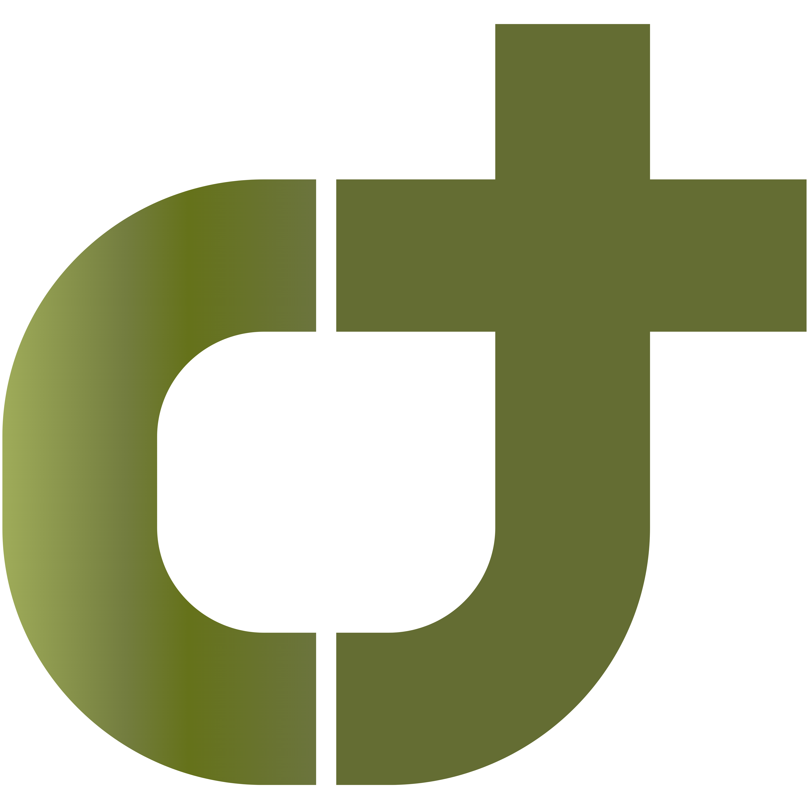
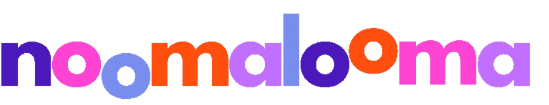

<!-- ===================================================================== -->
<!--                         ANIMATED HEADER BANNER                         -->
<!-- ===================================================================== -->
<div align="center">
  
</div>

<!-- ===================================================================== -->
<!--                         TYPING ANIMATION                              -->
<!-- ===================================================================== -->
<div align="center">
  <a href="https://github.com/ayush1014">
    
  </a>
</div>

<!-- ===================================================================== -->
<!--                         PROFILE BADGES                                -->
<!-- ===================================================================== -->
<div align="center">
  
  <a href="https://linkedin.com/in/ayushkanaujia-ak1410"></a>
  <a href="https://ayushkanaujia.com"></a>
  <a href="https://citetalk.com"></a>
  <a href="mailto:kanaujiaayush1499@gmail.com"></a>
</div>

<br>

## 👨‍💻 About Me

I'm a **Full Stack AI Engineer** who takes ambitious ideas from **0-to-1** by architecting full systems end-to-end using native iOS apps, React frontends, FastAPI backends, multi-agent LLM orchestration, and cloud infrastructure that scales.

- 🚀 **Founding Engineer** @ **NoomaLooma** — built the platform from scratch, scaled to **5,000+ users** ahead of 2026 App Store launch
- 🔍 **Creator** of [**CiteTalk.com**](https://citetalk.com) — multi-agent research platform with real-time voice agents and folder knowledge management, orchestrating **24+ LLMs**, serving **1,000+ users**
- 🤖 Deep focus: **agentic AI systems** — LangGraph, LangChain, MCP, multi-agent orchestration, hybrid/graph RAG, knowledge graphs
- 🎓 **M.S. Information Systems** (GPA 4.00 / 4.00) — Northwest Missouri State University
- 🎓 **B.S. Computer Science** — Northwest Missouri State University
- 📍 Based in **Atlanta, GA** • Open to remote & relocation across the US
- ⚡ Currently shipping: multi-agent AI Solutions, full-stack end-to-end AI Applications, 0-to-1 public facing products, realtime voice agents with <400ms latency, Cloud Native development (**GCP**, **AWS**), self-hosted retrieval pipelines

<br>

<div align="center">


<h3>🧠 Building AI that ships</h3>

<p>
  
  
  
  
</p>

</div>

---

## 🛠️ Tech Stack

### 💻 Languages
<p>
  
</p>

### 🎨 Frontend
<p>
  
</p>

### ⚙️ Backend & Databases
<p>
  
</p>

### 🤖 AI / ML / Agentic
<p>
  
  
  
  
  
  
  
  
  
</p>

### ☁️ Cloud & DevOps
<p>
  
  
  
</p>

---

## 🚀 Featured Projects

### 🔍 [CiteTalk.com](https://citetalk.com)

<div align="left">
  <div style="display: flex; align-items: center; gap: 2px;">
    
    
  </div>
</div>

**Agentic research platform with real-time voice AI**

- Multi-agent deep research system (**LangGraph + LangChain + MCP**) orchestrating **24+ LLMs** via autonomous task decomposition
- Self-hosted search engine with real-time crawler - **zero dependency** on third-party search APIs
- Hybrid retrieval (dense + sparse + rerank) for citation-grounded multi-source synthesis
- Folder-based knowledge management with vector search (**pgVector**) and graph visualization (**Neo4j**) for personal research graph
- Hybrid infra: **Dockerized FastAPI backend** on **GCP Cloud Run**, React/Vite frontend, PostgreSQL/pgVector database
- Hybrid RAG(BM25 + dense retrieval) pipeline with **custom-trained LoRA/QLoRA models** for cost-efficient synthesis.
- Real-time voice agent at **sub-second latency** 
- **1,000+ users** • Deployed on GCP Cloud Run

`Python` `FastAPI` `React/Vite` `PostgreSQL/pgVector` `LangChain` `LangGraph` `LiteLLM` `Docker` `GCP`

🔒 *Source private — happy to walk through architecture on a call*

<br clear="right" />

---

### 🌟 NoomaLooma *(stealth)*

<div align="left">
  
</div>

**0 → 1 platform as Founding Engineer**

- Architected end-to-end: native **iOS (Swift)**, **React** web admin dashboard, **FastAPI**, **NeonDB/PostgreSQL**
- Multi-agent creative generation pipeline (LangGraph + MCP, hybrid RAG(BM25 + vector search), custom-trained LoRA/QLoRA models) for AI-powered content creation and curation.
- Real-time AI moderation pipeline (**WebSockets + cron**) at **<100ms latency**
- Hybrid **GCP/AWS** infra with Dockerized CI/CD
- **5,000+ users** scaling to 2026 App Store Early Access launch

`iOS` `React` `FastAPI` `NeonDB` `LangGraph` `MCP` `Docker` `GCP` `AWS`

🔒 *Private — confidential pre-launch product*

<br clear="right" />

> ### 🔒 A Note on Private Repositories
>
> Most of my production work — including **NoomaLooma's full platform** and **CiteTalk.com's complete stack** — lives in private repositories due to confidentiality, IP protection, and active development. The public surface here is a small slice. **I'm always happy to walk through architecture, system design decisions, and specific implementations on a call.**

---

## 📊 GitHub Analytics

<div align="center">


<br>


<br><br>


<br><br>


</div>

---

## 🐍 Contribution Snake

<div align="center">
  
</div>

---

## ⚡ Currently...

```yaml
🔭 Working on:     Scaling NoomaLooma's multi-agent pipeline + CiteTalk's real-time voice AI
🌱 Learning:       Advanced model distillation, MCP server design patterns, RL agents
👯 Collab on:      Agentic AI tooling, voice-first interfaces, hybrid retrieval systems
💬 Ask me about:   Building 0→1 AI products, multi-agent orchestration, founding-engineer life
🎯 Goal for 2026:  Ship NoomaLooma to App Store, grow CiteTalk to 10k+ users
⚡ Fun fact:       I built CiteTalk solo — search engine, crawler, voice AI, and all
```

---

<div align="center">

## 🤝 Let's Build Something Together

*Whether you're hiring, building something ambitious, or just want to talk agentic AI — my inbox is open.*

<br>

<a href="https://linkedin.com/in/ayushkanaujia-ak1410">
  
</a>
<a href="https://ayushkanaujia.com">
  
</a>
<a href="https://citetalk.com">
  
</a>
<a href="mailto:kanaujiaayush1499@gmail.com">
  
</a>

<br><br>


<br>


</div>
